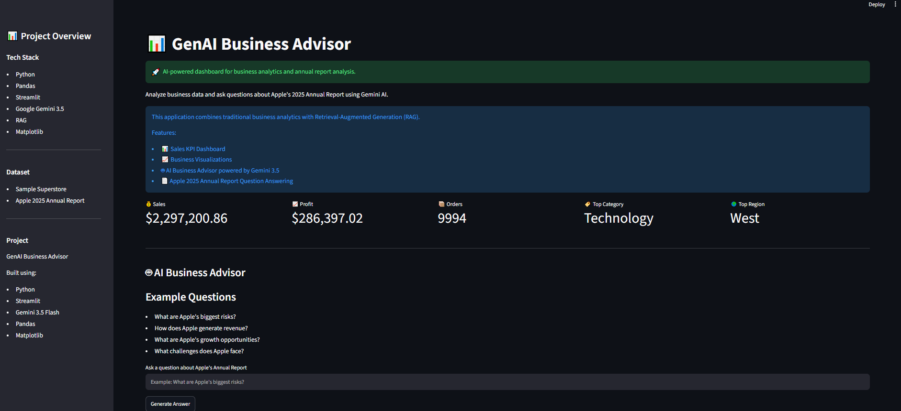
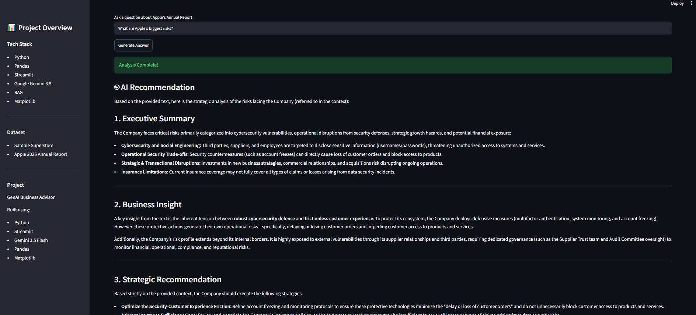
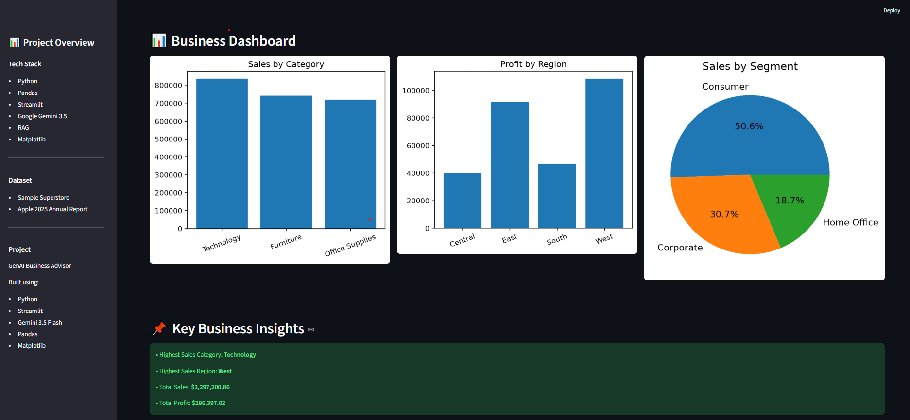

#  GenAI Business Advisor

An AI-powered business analytics dashboard that combines traditional data analysis with Retrieval-Augmented Generation (RAG) to analyze business data and answer questions about company annual reports.

##  Project Goal

This project demonstrates how Generative AI can be combined with business analytics to help users explore structured sales data and analyze company annual reports through natural language queries. It showcases practical applications of Python, data visualization, and AI for business decision support.

---

##  Features

-  Interactive KPI dashboard for sales and profit analysis
-  Business visualizations by category, region, and customer segment
-  AI-powered business advisor using Google Gemini 3.5 Flash
-  Natural language analysis of Apple's 2025 Annual Report
-  Retrieval-Augmented Generation (RAG) using document chunking
-  Streamlit caching for improved performance
-  Executive summaries and strategic recommendations

---

##  Tech Stack

- Python
- Pandas
- Streamlit
- Google Gemini 3.5 Flash
- Matplotlib
- python-dotenv

---

##  Project Structure

```
genai-business-advisor/
│
├── data/
│   └── SampleSuperstore.csv
│
├── documents/
│   ├── Apple_2025_Annual_Report.pdf
│   └── apple_report.txt
│
├── images/
│   ├── homepage.png
│   ├── ai-analysis.png
│   └── dashboard.png
│
├── src/
│   ├── app.py
│   ├── analysis.py
│   └── build_knowledge.py
│
├── requirements.txt
├── README.md
├── .gitignore
└── .env
```

---

## 📈 Business Insights Generated

The dashboard automatically identifies:

- Highest sales category
- Highest performing region
- Overall sales and profit
- Customer segment distribution
- AI-generated executive summaries
- Strategic recommendations based on annual report content

##  Screenshots

###  Home Page



---

###  AI Business Advisor



---

###  Business Dashboard



---

##  Installation

Clone the repository

```bash
git clone YOUR_GITHUB_LINK
```

Open the project

```bash
cd genai-business-advisor
```

Create a virtual environment

```bash
python -m venv venv
```

Activate it

Windows

```bash
venv\Scripts\activate
```

Install dependencies

```bash
pip install -r requirements.txt
```

Create a `.env` file

```
GEMINI_API_KEY=your_api_key_here
```

Run the application

```bash
streamlit run src/app.py
```

---

##  Key Highlights

- Developed a complete end-to-end AI business analytics application using Python and Streamlit.
- Built interactive KPI dashboards and business visualizations with Pandas and Matplotlib.
- Integrated Google Gemini 3.5 Flash to generate executive summaries and strategic recommendations.
- Implemented a lightweight Retrieval-Augmented Generation (RAG) pipeline using document chunking.
- Optimized application performance using Streamlit's caching mechanism.

---

## 🚀 Future Improvements

- Upload and analyze any company's annual report
- Automatic SWOT analysis generation
- Competitor comparison dashboard
- Financial ratio analysis
- Download AI-generated reports as PDF
- PowerPoint export for executive presentations

##  Skills Demonstrated

- Python Programming
- Data Analysis
- Data Visualization
- Business Analytics
- Generative AI
- Retrieval-Augmented Generation (RAG)
- Prompt Engineering
- Streamlit Development

##  Disclaimer

This project was developed for learning and portfolio purposes. Company reports used for analysis remain the property of their respective organizations.